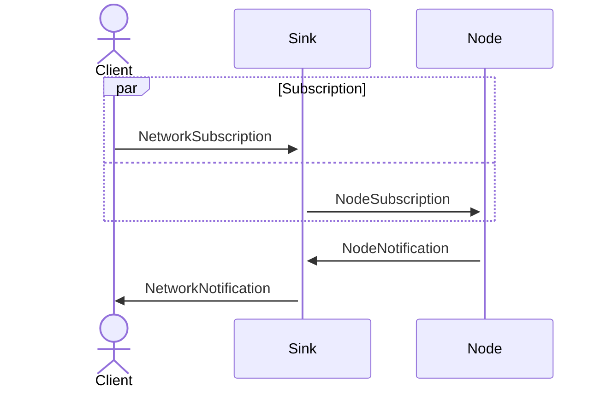

# オブザーバー

ネットワークの状態を監視するプロトコル

## プロトコル番号

4

## プロトコル

下位プロトコルとして[Routing](./routing.md#Routing) を使用している．

## 責務

このプロトコルは，ネットワークに参加している各ノードに対し，以下の3つの責務のうちどれかを果たすように求める．

なお，責務は1つのノードか兼ねることもできる

| 役割   | 説明                                              | 対象ノード                           |
| ------ | ------------------------------------------------- | ------------------------------------ |
| Node   | SinkからSubscribeを受け取り，Sinkにログを送信する | ネットワークを構成するるべてのノード |
| Sink   | NodeにSubscribeを送り，Clientにログを送信する     | サーバ，(エミュレータ)               |
| Client | SinkにSubscribeを送り，Sinkからログを受け取る     | エミュレータ                         |

## フレームの分類

### `Subscription`と`Notification`

このプロトコルで送受信されるフレームには，大きく`Subscription`と`Notification`の二つに分けることが出来る．

| 分類           | 役割                                 |
| -------------- | ------------------------------------ |
| `Subscription` | Notificationの送信を求める           |
| `Notification` | ネットワーク・ノードの変更を通知する |

例えば，ノードAからノードBへ`Subscriptino`を送信することは，ノードBはノードAへ`Notification`を送信するよう要求されてたこととなる．

重要なこととして，このプロトコルでは新規作成と更新を区別しない．例えば，新しいノードの接続と，既存のノードのプロパティの変更は同じフレームでやり取りされる．何故ならば，パケットロスにより新規作成フレームを受信できなかった場合，その後に受信した更新フレームに基づいて新規作成を行うことになる．この場合新規作成と更新で行う処理が変わらないため，最初から区別した方が実装が楽だからだ．

### `Node`と`Network`

`Subscription`と`Notification`による分け方の他に，`Node`と`Network`によるフレームの分け方がある．

| 分類      | 役割                                           |
| --------- | ---------------------------------------------- |
| `Node`    | 自分自身とそのネイバーで起こったイベントの通知 |
| `Network` | ネットワーク全体で起こったことの通知           |

### フレームタイプ

これらを踏まえて，フレームタイプを以下に示す．

| フレームタイプ      | 値  | 説明                                      | 送信元 | 宛先   |
| ------------------- | --- | ----------------------------------------- | ------ | ------ |
| NodeSubscription    | 1   | `Node`の範囲のイベントの通知を要求する    | Sink   | Node   |
| NodeNotification    | 2   | `Node`の範囲のイベントを通知する          | Node   | Sink   |
| NetworkSubscription | 3   | `Network`の範囲のイベントの通知を要求する | Client | Sink   |
| NetworkNotification | 4   | `Network`の範囲のイベントを通知する       | Sink   | Client |

また，実際のフレームのやり取りの流れを以下に示す．

## フレーム

### NodeSubscriptionフレーム

`Node`の範囲の通知を要求する

| #   | フィールド名   | サイズ(byte) | 値                   |
| --- | -------------- | ------------ | -------------------- |
| 1   | フレームタイプ | 1            | 1 (NodeSubscription) |

### NodeNotificationフレーム

`Node`の範囲の通知を行う

#### ノード通知タイプ

| 名称            | 値  |
| --------------- | --- |
| SelfUpdated     | 1   |
| NeighborUpdated | 2   |
| NeighborRemoved | 3   |

#### NodeNotification -- SelfUpdatedフレーム

送信元ノードの変更を通知する

| #   | フィールド名     | サイズ(byte) | 備考                 |
| --- | ---------------- | ------------ | -------------------- |
| 1   | フレームタイプ   | 1            | 2(NodeNotification)  |
| 2   | ノード通知タイプ | 1            | 1(SelfUpdated)       |
| 3   | コスト           | 2            | 送信元ノードのコスト |

#### NodeNotification -- NeighborUpdatedフレーム

ネイバー関係の変更(ネイバー関係の確立 or リンクコスト変更)を通知する．

フィールドに含まれてはいるが，ネイバーコストの変更ではこのフレームは送信してはいけない．

| #   | フィールド名     | サイズ(byte) | 備考                                     |
| --- | ---------------- | ------------ | ---------------------------------------- |
| 1   | フレームタイプ   | 1            | 2(NodeNotification)                      |
| 2   | ノード通知タイプ | 1            | 2(NeighborUpdated)                       |
| 3   | ローカルコスト   | 2            | 送信元ノードのコスト                     |
| 4   | ネイバーID       | 可変長       | 変更のあったネイバーのID                 |
| 5   | ネイバーコスト   | 2            | 変更のあったネイバーのコスト             |
| 6   | リンクコスト     | 2            | 送信元ノードとネイバー間のリンクのコスト |

#### NodeNotification -- NeighborRemovedフレーム

ネイバー関係の削除を通知する．

| #   | フィールド名     | サイズ(byte) | 備考                             |
| --- | ---------------- | ------------ | -------------------------------- |
| 1   | フレームタイプ   | 1            | 2(NodeNotification)              |
| 2   | ノート通知タイプ | 1            | 3(NeighborRemoved)               |
| 3   | ネイバーID       | 可変長       | 削除されたネイバー関係のネイバー |

### NetworkSubscriptionフレーム

`Network`の範囲の通知を要求する

| #   | フィールド名   | サイズ(byte) | 値                     |
| --- | -------------- | ------------ | ---------------------- |
| 1   | フレームタイプ | 1            | 3(NetworkSubscription) |

### NetworkNotificationフレーム

`Network`の範囲の通知を行う

| #    | フィールド名   | サイズ(byte) | 値                                      |
| ---- | -------------- | ------------ | --------------------------------------- |
| 1    | フレームタイプ | 1            | 4(NetworkNotification)                  |
| 2    | エントリ数     | 1            | フレームに含まれるエントリの数          |
| 3... | エントリ       | 可変長       | 下に示す4種類のエントリを複数保持する． |

#### ネットワーク通知エントリタイプ

| 名称        | 値  |
| ----------- | --- |
| NodeUpdated | 1   |
| NodeRemoved | 2   |
| LinkUpdated | 3   |
| LinkRemoved | 4   |

#### NodeUpdatedNotficationエントリ

ノードの変更の情報を持つエントリ

| #   | フィールド名                   | サイズ(byte) | 値                         |
| --- | ------------------------------ | ------------ | -------------------------- |
| 1   | ネットワーク通知エントリタイプ | 1            | 1(NodeUpdated)             |
| 2   | ID                             | 可変長       | 変更のあったノードのID     |
| 3   | コスト                         | 2            | 変更のあったノードのコスト |

#### NodeRemovedNotificationエントリ

ノードの削除の情報を持つエントリ

| #   | フィールド名                   | サイズ(byte) | 値                   |
| --- | ------------------------------ | ------------ | -------------------- |
| 1   | ネットワーク通知エントリタイプ | 1            | 2(NodeRemoved)       |
| 2   | ID                             | 可変長       | 削除されたノードのID |

#### LinkUpdatedNotificationエントリ

リンクの変更の情報を持つエントリ

| #   | フィールド名                   | サイズ(byte) | 値                                           |
| --- | ------------------------------ | ------------ | -------------------------------------------- |
| 1   | ネットワーク通知エントリタイプ | 1            | 3(LinkUpdated)                               |
| 2   | ソースID                       | 可変長       | 変更のあったリンクの一端のノードのID         |
| 3   | ソースコスト                   | 2            | 変更のあったリンクの一端のノードのコスト     |
| 4   | デスティネーションID           | 可変長       | 変更のあったリンクのもう一端のノードのID     |
| 5   | デスティネーションコスト       | 2            | 変更のあったリンクのもう一端のノードのコスト |
| 6   | リンクコスト                   | 2            | 変更のあったリンクのコスト                   |

#### LinkRemovedNotificationエントリ

| #   | フィールド名                   | サイズ(byte) | 値                                     |
| --- | ------------------------------ | ------------ | -------------------------------------- |
| 1   | ネットワーク通知エントリタイプ | 1            | 4(LinkRemoved)                         |
| 2   | ソースID                       | 可変長       | 削除されたリンクの一端のノードのID     |
| 3   | デスティネーションID           | 可変長       | 削除されたリンクのもう一端のノードのID |
